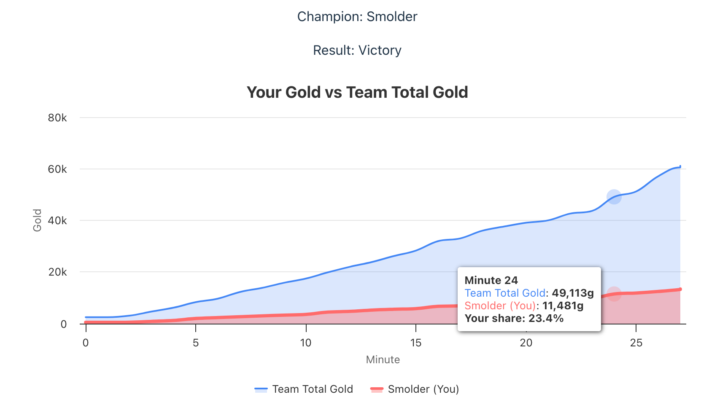

# League of Legends Match Analysis

A web application for analysing League of Legends match performance, featuring interactive gold progression charts and team comparisons.



## Features

- **Match Analysis**: View detailed statistics from your most recent League of Legends game
- **Gold Progression Tracking**: Interactive charts showing your gold accumulation vs team total
- **Team Comparison**: Visual representation of your economic contribution to the team
- **Real-time Data**: Fetches live data from the Riot Games API

## Tech Stack

### Frontend
- **React** with TypeScript
- **Vite** for development and build tooling
- **Highcharts** for interactive data visualisation
- **Axios** for API communication

### Backend
- **FastAPI** (Python)
- **Riot Games API** integration
- Environment-based API key management

## Project Structure

```
lol-analyse/
├── frontend/
│   ├── src/
│   │   ├── components/
│   │   │   └── GoldGraph.tsx
│   │   ├── App.tsx
│   │   └── main.tsx
│   ├── vite.config.ts
│   └── package.json
└── backend/
    ├── main.py (FastAPI) 
    └── requirements.txt
```

## Setup

### Prerequisites
- Node.js 16+
- Python 3.8+
- Riot Games API key ([Get one here](https://developer.riotgames.com/))

### Installation

1. **Clone the repository**
   ```bash
   git clone <repository-url>
   cd lol-analyse
   ```

2. **Frontend Setup**
   ```bash
   cd frontend
   npm install
   ```

3. **Backend Setup**

   ```bash
   cd backend
   pip install fastapi uvicorn httpx python-dotenv
   ```

4. **Environment Configuration**
   ```bash
   # Set your Riot API key
   export RIOT_API_KEY="your_riot_api_key_here"
   ```

### Running the Application

1. **Start the Backend**

   ```bash
   cd backend
   RIOT_API_KEY=your_key_here uvicorn main:app --reload
   ```

2. **Start the Frontend**
   ```bash
   cd frontend
   npm run dev
   ```

3. **Access the Application**
   - Frontend: http://localhost:5173
   - Backend API: http://localhost:8000

## API Endpoints

### `GET /stats/{gameName}/{tagLine}`

Retrieves match statistics and gold progression data for a player.

**Response:**
```json
{
  "summonerInfo": {
    "gameName": "PlayerName",
    "tagLine": "EUW",
    "championPlayed": "Jinx",
    "win": true
  },
  "team_gold_data": [
    {
      "championName": "Jinx",
      "gold_over_time": [[0, 500], [1, 800], [2, 1200]],
      "isCurrentPlayer": true
    }
  ]
}
```

## Features in Detail

### Gold Progression Chart
- **Overlapping Areas**: Shows your gold vs total team gold
- **Interactive Tooltips**: Displays exact values and your percentage contribution
- **Real-time Updates**: Based on match timeline data from Riot API

### Data Visualisation
- **Highcharts Integration**: Smooth area spline charts
- **Custom Styling**: Player data highlighted with distinct colors
- **Responsive Design**: Adapts to different screen sizes