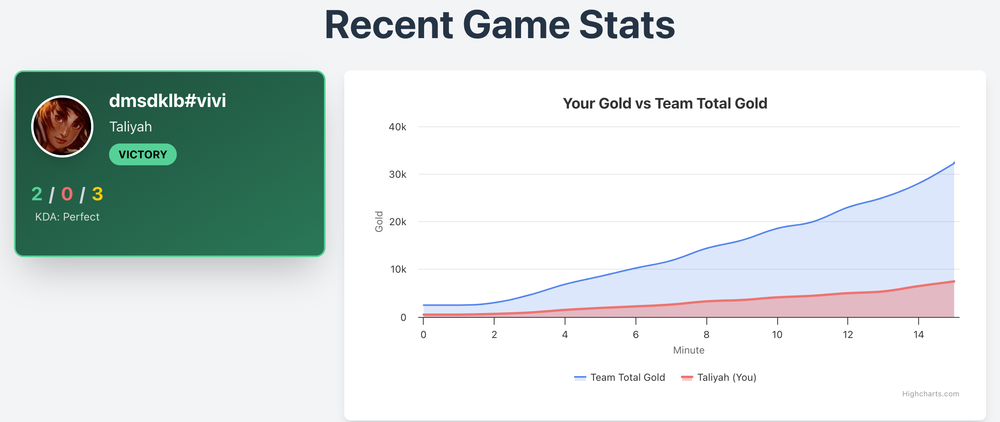

# League of Legends Match Analysis

A comprehensive web application for analysing League of Legends match performance, featuring interactive charts, player comparisons, and detailed statistics with an intuitive carousel interface.



## Features

- **Comprehensive Match Analysis**: View detailed statistics from your most recent League of Legends game
- **Gold Progression Tracking**: 
  - Your gold vs team total gold
  - Your gold vs enemy laner comparison
  - Team gold advantage over time
- **Performance Analytics**: 
  - Damage contribution analysis
  - Time distribution charts showing gold advantage periods
- **Player Cards**: Visual comparison between you and your enemy laner
- **Real-time Data**: Fetches live data from the Riot Games API

## Tech Stack

### Frontend
- **React 19** with TypeScript
- **Vite** for development and build tooling
- **Tailwind CSS** for responsive styling
- **Highcharts** for interactive data visualisation
- **Axios** for API communication

### Backend
- **FastAPI** (Python)
- **Riot Games API** integration

## Project Structure

```
lol-analyse/
├── frontend/
│   ├── src/
│   │   ├── components/
│   │   │   ├── AreaLineGraph.tsx    # Interactive line/area charts
│   │   │   ├── GraphCarousel.tsx    # Carousel navigation component
│   │   │   ├── PieChart.tsx         # Pie chart visualisations
│   │   │   └── PlayerCard.tsx       # Player information cards
│   │   ├── App.tsx                  # Main application component
│   │   ├── interface.ts             # TypeScript type definitions
│   │   └── main.tsx                 # Application entry point
│   ├── vite.config.ts
│   ├── tailwind.config.ts
│   └── package.json
└── backend/
    ├── main.py                      # FastAPI application
    └── requirements.txt
```

## Setup

### Prerequisites
- Node.js 16+
- Python 3.8+
- Riot Games API key ([Get one here](https://developer.riotgames.com/))

### Installation

1. **Clone the repository**
   ```bash
   git clone <repository-url>
   cd lol-analyse
   ```

2. **Frontend Setup**
   ```bash
   cd frontend
   npm install
   ```

3. **Backend Setup**
   ```bash
   cd backend
   pip install -r requirements.txt
   ```

4. **Environment Configuration**
   ```bash
   # Set your Riot API key
   export RIOT_API_KEY="your_riot_api_key_here"
   ```

### Running the Application

1. **Start the Backend**
   ```bash
   cd backend
   RIOT_API_KEY=your_key_here uvicorn main:app --reload
   ```

2. **Start the Frontend**
   ```bash
   cd frontend
   npm run dev
   ```

3. **Access the Application**
   - Frontend: http://localhost:5173
   - Backend API: http://localhost:8000

## API Endpoints

### `GET /stats/{gameName}/{tagLine}`

Retrieves comprehensive match statistics and progression data for a player.

**Response:**
```json
{
  "playerInfo": {
    "gameName": "PlayerName",
    "tagLine": "EUW",
    "championPlayed": "Jinx",
    "championPfp": "jinx.png",
    "win": true,
    "kills": 12,
    "deaths": 3,
    "assists": 8,
    "lane": "BOTTOM",
    "role": "CARRY",
    "items": [...],
    "trinket": {...}
  },
  "enemyLanerInfo": {
    "championPlayed": "Ashe",
    "win": false,
    "kills": 8,
    "deaths": 7,
    "assists": 12,
    "items": [...],
    "trinket": {...}
  },
  "team_gold_data": [
    {
      "championName": "Jinx",
      "gold_over_time": [[0, 500], [1, 800], [2, 1200]],
      "damage_over_time": [[0, 100], [1, 250], [2, 450]],
      "isCurrentPlayer": true
    }
  ],
  "enemy_team_gold_data": [...]
}
```

## Features in Detail

### Analysis Charts

#### 1. **Gold Progression Analysis**
- **Your Gold vs Team Total**: Shows your economic contribution percentage
- **Your Gold vs Enemy Laner**: Direct lane opponent comparison
- **Team Gold Advantage**: Overall team economic state over time

#### 2. **Performance Metrics**
- **Damage Analysis**: Your damage output vs team total
- **Time Distribution**: Pie chart showing periods of gold advantage/disadvantage

#### 3. **Player Comparison**
- **Player Cards**: Side-by-side comparison of key stats
- **Item Builds**: Visual representation of completed items
- **KDA Comparison**: Kills, deaths, assists tracking

### Data Visualisation Features
- **Highcharts Integration**: Professional-grade interactive charts
- **Custom Styling**: Player data highlighted with distinct colors and fill areas
- **Responsive Design**: Adapts seamlessly to different screen sizes
- **Tooltip Information**: Detailed data on hover
- **Percentage Calculations**: Automatic contribution percentage displays

### User Experience
- **Loading States**: Smooth loading indicators
- **Error Handling**: Graceful error display and recovery
- **Keyboard Navigation**: Accessibility-focused carousel controls

## Development

### Frontend Scripts
```bash
npm run dev      # Start development server
npm run build    # Build for production
npm run lint     # Run ESLint
npm run preview  # Preview production build
```

### Backend Development
```bash
uvicorn main:app --reload  # Development server with auto-reload
```

## Future Enhancements
- Match history analysis
- Champion-specific insights
- Team composition analysis
- Performance trends over time
- Export functionality for charts and data